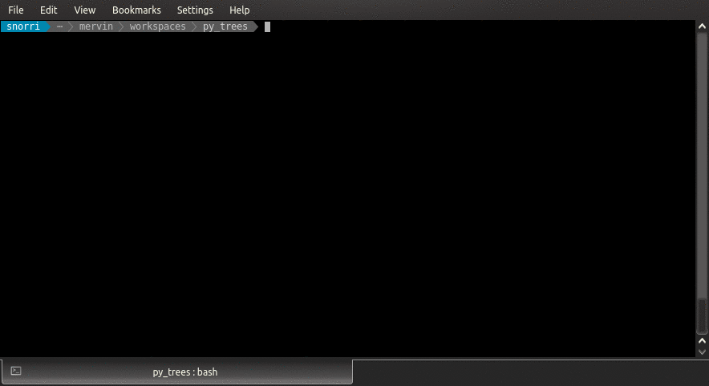

.. _py-trees-ros-demos-section-label:

Demos
=====

.. _py-trees-ros-demo-exchange:

Demo Exchange
-------------

There are three working parts to exchange demo:

* :ref:`demo-exchange-node` : scripts a demo tree with an exchange in a ROS node
* :ref:`demo-exchange-launch` : launches the demo tree/exchange node
* :ref:`demo-exchange-watcher`: tune into the exchange's services to watch the blackboard

.. _demo-exchange-node:

Node
^^^^

The node creates a simple sequence with two custom blackboard writers as children and attaches
an exchange to it.

.. graphviz:: dot/demo-exchange.dot

.. literalinclude:: ../py_trees_ros/demos/exchange.py
   :language: python
   :linenos:
   :caption: py_trees_ros/demos/exchange.py

.. _demo-exchange-launch:

Launcher
^^^^^^^^

.. literalinclude:: ../launch/demo_exchange.launch
   :language: xml
   :linenos:
   :caption: launch/demo_exchange.launch

Watcher
^^^^^^^

Once launched, you can fire up :ref:`py-trees-blackboard-watcher` to list the variables and watch variables:

.. code-block:: bash

    $ py-trees-blackboard-watcher --list-variables
    ....
    $ py-trees-blackboard-watcher gnocchi
    ....

.. image:: images/watcher.gif

