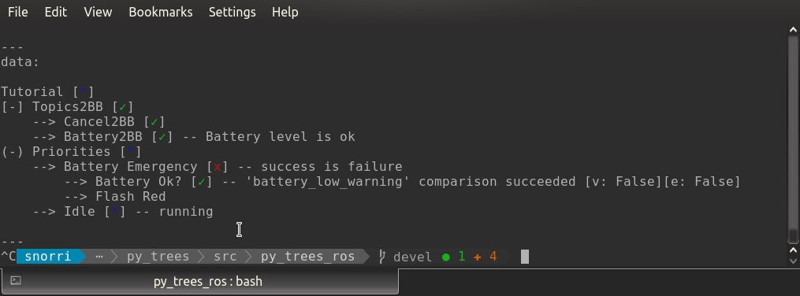

Features
========

.. seealso::
    The :ref:`Tutorials <py-trees-ros-tutorials-section>` where most of the following
    is demonstrated.

Behaviours
----------

.. autosummary::

   py_trees_ros.actions.ActionClient
   py_trees_ros.battery.ToBlackboard
   py_trees_ros.subscribers.CheckData
   py_trees_ros.subscribers.EventToBlackboard
   py_trees_ros.subscribers.ToBlackboard
   py_trees_ros.subscribers.WaitForData

Blackboards
-----------

.. automodule:: py_trees_ros.blackboard
    :noindex:

Trees
-----

.. automodule:: py_trees_ros.trees
    :noindex:

Visualisation
-------------

You can visualise the trees in ROS via either the ascii tree publishers:

.. code-block:: bash

   rostopic echo /tree/ascii/snapshot

or the `rqt_py_trees` plugin which tunes in to the `~log/tree` topic.

.. image:: images/rqt-py-trees.png
