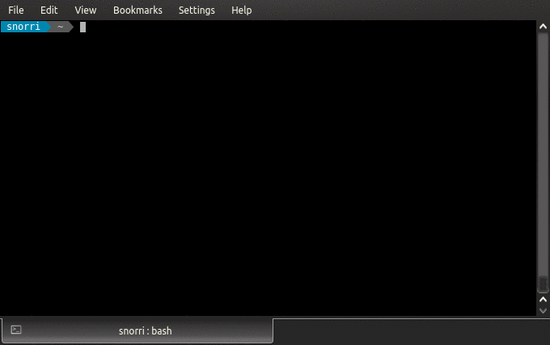
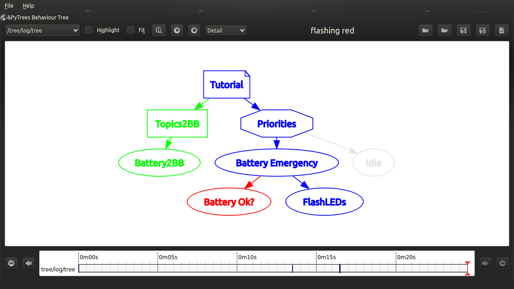

.. _py-trees-ros-tutorials-section:

Tutorials
=========

Dependencies
------------

The tutorials require installation of a few graphical dependencies that
would otherwise unnecessarily explode the requirements of the core package
and modules. e.g. for kinetic:

.. code-block:: bash

    sudo apt install ros-kinetic-rqt-py-trees ros-kinetic-rqt-reconfigure

The Mock Robot
--------------

The tutorials here all run atop a very simple :term:`mock` robot that
encapsulates the following list of mocked components:

* Battery
* LED Strip
* Docking Action Server
* Move Base Action Server
* Rotation Action Server
* Safety Sensors Pipeline

This :term:`mock` robot could just as easily be replaced by a gazebo
simulated robot or even real robot with the same ROS API
abstraction layer.

The tutorials take care of launching the mock robot, but it can be
launched on its own with:

.. literalinclude:: ../launch/mock_robot.launch
   :language: xml
   :linenos:
   :caption: py_trees_ros/launch/mock_robot.launch

.. _tutorial-one:

Tutorial 1 - Data Gathering
---------------------------

.. automodule:: py_trees_ros.tutorials.one
    :synopsis: data gathering with the battery to blackboard behaviour

.. _tutorial-two:

Tutorial 2 - Adding a Battery Check
-----------------------------------

.. automodule:: py_trees_ros.tutorials.two
    :synopsis: decision making conditional on a low battery state

.. _tutorial-three:

Tutorial 3 - Blackboards!
-------------------------

About
^^^^^

Tutorial three is a repeat of :ref:`tutorial-two`. The purpose of this
tutorial however is to introduce the publishers and services provided to
allow introspection of the blackboard from ROS. Publishers and services
are provided by the :class:`Blackboard Exchange <py_trees_ros.blackboard.Exchange>`
embedded in the :class:`ROS Behaviour Tree <py_trees_ros.trees.BehaviourTree>`
and interaction via the :ref:`py-trees-blackboard-watcher` command line utility.

Running
^^^^^^^

Launch the tutorial:

.. code-block:: bash

    $ roslaunch py_trees_ros tutorial_three.launch --screen

In another shell:

.. code-block:: bash

    # check the entire board
    $ py-trees-blackboard-watcher
    # determine what you may stream
    $ py-trees-blackboard-watcher --list-variables
    # pull a simple variable
    $ py-trees-blackboard-watcher battery_low_warning
    # drill down to get a variable
    $ py-trees-blackboard-watcher battery/percentage

.. _tutorial-four:

Tutorial 4 - Introspecting the Tree
-----------------------------------

About
^^^^^

Again, this is a repeat of :ref:`tutorial-two`. The
:class:`ROS Behaviour Tree <py_trees_ros.trees.BehaviourTree>` used in these
tutorials provide several ROS connections for tree introspection. We will walkthrough
several of these here:

Running
^^^^^^^

**Launch**

.. code-block:: bash

    $ roslaunch py_trees_ros tutorial_four.launch --screen

**Shell Introspection**

.. code-block:: bash

    # identify the tree publishers
    $ rostopic list | grep tree
    # a static ascii view of the tree (lacks formatting)
    $ rostopic echo /tree/ascii/tree
    # a static ascii view of the tree (with formatting)
    $ py-trees-tree-watcher --tree
    # a dynamic view of the tree (lacks formatting), with current state and feedback messages
    $ rostopic echo /tree/ascii/snaphots
    # a dynamic view of the tree (with formatting)
    $ py-trees-tree-watcher --snapshot
    # at what behaviour did decision making turn around and why? often useful for other programs to know
    $ rostopic echo /tree/tip

and of course the blackboard topics, but they were covered in tutorial three.

.. image:: images/tutorial-four-topics.gif

**RQT Visualisation**

There is one more topic that provides the complete set of data for a tree state, that is `~/log/tree`.
This is not very human readable (typically very large), but can be used for other tools such as
``rqt-py-trees``.

While not in this package itself, it's worth taking some time out to discover what it can do here.

* *Coloured States* : GREEN for :attr:`~py_trees.common.Status.SUCCESS`, RED for :attr:`~py_trees.common.Status.FAILURE`, BLUE for :attr:`~py_trees.common.Status.RUNNING` and GREY for unvisited.
* *Tooltips* : hover over a behaviour to catch name, type, status and feedback message information
* *Timeline* : rewind as you wish, note the bars indicating where important events occured
* *Fit* : disable auto-resizing by unchecking the 'Fit' button to handle large trees which become unreadable in a small window

.. _tutorial-actions:

Tutorial 5 - Action Clients
---------------------------

.. automodule:: py_trees_ros.tutorials.five
    :synopsis: action client behaviours and a manually triggered work priority branch

.. _tutorial-context-switching:

Tutorial 6 - Context Switching
------------------------------

.. automodule:: py_trees_ros.tutorials.six
    :synopsis: adding a context switch around an action(s)

.. _tutorial-full-scenario:

Tutorial 7 - Docking, Cancelling & Failing
------------------------------------------

.. automodule:: py_trees_ros.tutorials.seven
    :synopsis: full job subtree with docking, cancelling and failure notifications

.. _tutorial-dynamic:

Tutorial 8 - Dynamic Job Handling
---------------------------------

.. automodule:: py_trees_ros.tutorials.eight
    :synopsis: loading jobs specified at runtime and dynamically inserting job subtrees

.. _tutorial-bags:

Tutorial 9 - Bags
-----------------

About
^^^^^

Tutorial nine is a repeat of :ref:`tutorial-dynamic` with some pointers
illustrating how the bagging functionality of the :class:`~py_trees_ros.trees.BehaviourTree`.

Running
^^^^^^^

.. code-block:: bash

    $ roslaunch py_trees_ros tutorial_nine.launch --screen

Bagging starts as soon as a :class:`~py_trees_ros.trees.BehaviourTree` is instantiated and
will record something only when the tree changes, i.e.

* behaviours are inserted or pruned from the tree
* a behaviour changes state
* the feedback message in a behaviour changes

Messages recorded are exactly the same type as those used to feed the
visual monitoring tool - rqt_py_trees. Trigger a scan and finally close down
the launcher. The bags will be saved in:

.. code-block:: bash

   ${ROS_HOME}/behaviour_trees/<date>/behaviour_tree_<date>.bag

Playback
^^^^^^^^

Restart the visual monitoring tool in playback mode on the latest
saved bag:

.. code-block:: bash

   # in a first shell
   roscore
   # in a second shell
   rqt_py_trees --latest-bag

Move around the replay via the timeline widget at the bottom of the plugin window.

Other Ideas
^^^^^^^^^^^

If you are executing *just in time* as in :ref:`tutorial-dynamic`, then an interesting
alternative is to use :class:`~py_trees_ros.trees.BehaviourTree` to inspire your own
behaviour tree manager that creates a bag that records for the duration of the job execution only.
That is, start as the job subtree is inserted and close the bag as the job subtree is pruned.
This provides small, modular bags for convenient storage and lookup.
